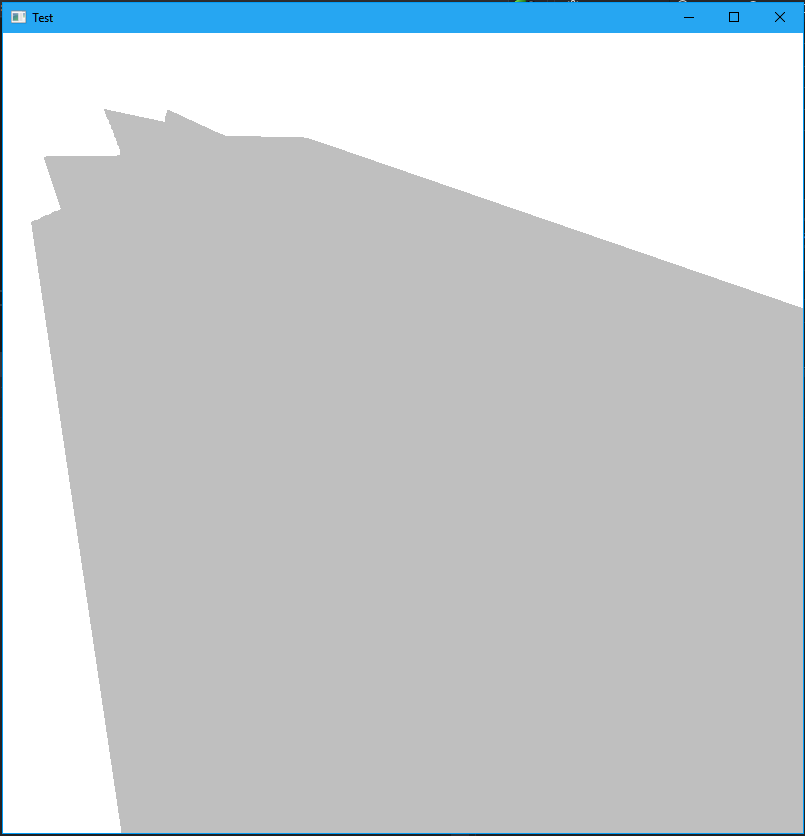

# SpriteMeshLighting
Light and Shadow Volume Construction for Sprite Sheet Objects using Outline Mesh Generation

### Libraries Used  

* [SFML](https://github.com/SFML/SFML)  
* [OpenCV](https://opencv.org/)  

The include paths for OpenCV and SFML must be added to your search path.

To generate the contour file, comment out main and uncomment the OpenCV code at the top

OpenCV contour code from: https://docs.opencv.org/3.3.1/df/d0d/tutorial_find_contours.html

Example:

#### Plain Sprite

#### Contoured Sprite  

  

#### Generated Shadow Volume  

  

#### Combined Sprite and Shadow Volume  

